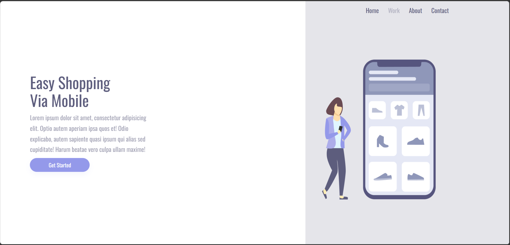
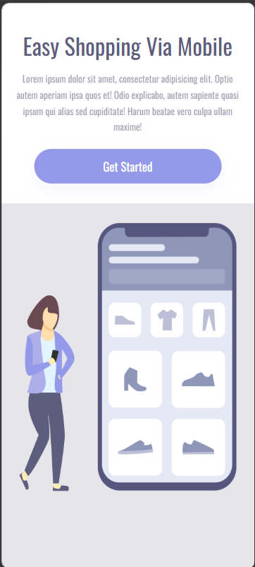

# Easy Shopping Via Mobile

Projeto desenvolvido durante os estudos no [DevClub](https://www.devclub.com.br/), com o objetivo de praticar conceitos fundamentais de **HTML** e **CSS**, criando uma landing page simples, moderna e responsiva.

## 📸 Preview do Projeto

### Versão Desktop



### Versão Mobile




---

## 📋 Sobre o Projeto

O **Easy Shopping Via Mobile** é uma página web criada principalmente para praticar estruturação com HTML e estilização com CSS.

O projeto não possui uma funcionalidade complexa. O foco principal está no desenvolvimento visual da página, organização do código, criação de layout responsivo e aplicação de boas práticas iniciais no front-end.

A proposta visual apresenta uma landing page para um serviço fictício de compras via celular, com título, texto descritivo, botão de chamada para ação, menu de navegação e imagem ilustrativa.

---

## 🎯 Objetivo do Projeto

O principal objetivo deste projeto foi colocar em prática os conhecimentos adquiridos em HTML e CSS, treinando:

- Estruturação de páginas web;
- Organização de elementos na tela;
- Criação de layouts modernos;
- Uso de cores, fontes e espaçamentos;
- Responsividade para diferentes tamanhos de tela;
- Boas práticas iniciais no desenvolvimento front-end.

---

## 🚀 Tecnologias Utilizadas

- HTML5
- CSS3
- Google Fonts
- Responsividade com Media Queries

---

## 🧠 Conceitos Praticados

Durante o desenvolvimento deste projeto, foram praticados diversos conceitos importantes de front-end, como:

### HTML

- Estrutura básica de um documento HTML;
- Uso de tags como `section`, `header`, `h1`, `p`, `button`, `a` e `img`;
- Organização do conteúdo em containers;
- Importação de arquivos externos;
- Uso de atributo `alt` em imagens;
- Configuração da viewport para responsividade.

### CSS

- Reset básico com seletor universal;
- Uso de `box-sizing: border-box`;
- Estilização global de fontes;
- Layout com CSS Grid;
- Alinhamento com Flexbox;
- Uso de cores em hexadecimal e `rgba`;
- Aplicação de espaçamentos com `padding`, `margin` e `gap`;
- Botão estilizado com bordas arredondadas;
- Efeitos de interação com `hover` e `active`;
- Controle de largura máxima dos elementos;
- Uso de funções modernas como `clamp()`, `min()` e `max-width`;
- Responsividade com `@media`;
- Adaptação do layout para desktop, tablet e celular.

---

## 📁 Estrutura do Projeto

```bash
easy-shopping-via-mobile/
│
├── index.html
├── Easy Shopping.css
├── easy shopping via mobile.png
├── preview-desktop.png
├── preview-mobile.png
└── README.md
